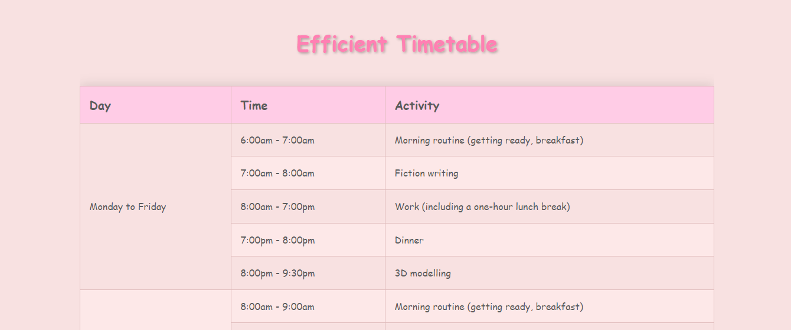

# Efficient Timetable

An efficient weekly timetable for those looking to balance their work life with learning new skills in 3D modeling, fiction writing, and programming.

example url : https://veridyia.github.io/timetable/

## Project Overview

This project is a simple and visually appealing timetable that helps users balance their work and personal life while pursuing new interests. The timetable is designed in HTML and CSS, providing an easy-to-read and playful layout.

## Features

- Responsive design
- Aesthetic and playful color scheme
- Clear activity descriptions
- Easy to customize and modify
- Suitable for individuals looking to balance work and personal growth

## How to Use

1. Clone or download the repository.
2. Open the `index.html` file in your preferred web browser.
3. Customize the HTML and CSS as needed to suit your preferences and schedule.

## Customization

- Change the font, colors, and styles in the `<style>` section of the `index.html` file.
- Update the timetable by editing the rows within the `<tbody>` element in the `index.html` file.

## License

This project is open-source and available for personal and commercial use under the [MIT License](./LICENSE).

